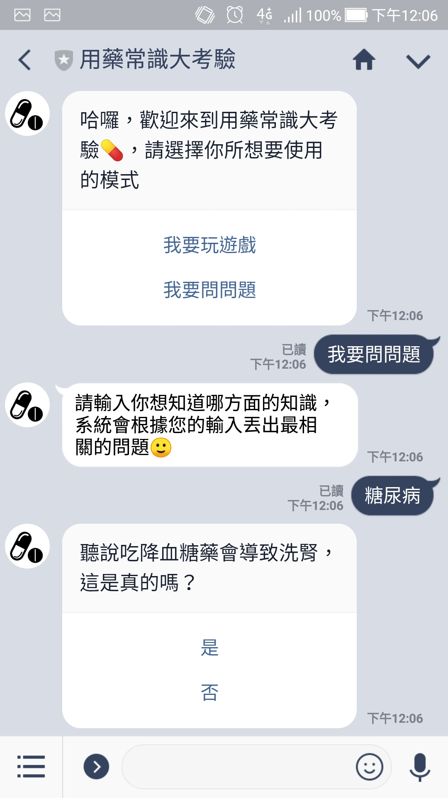

# 用藥常識大考驗 

用手機開啟LINE並掃描下方的QR code加機器人為好友後，就可以開始和機器人進行遊戲

     

這是我與另一位系上友人在自然語言處理課程所開發出的用藥常識小遊戲機器人，主要使用javascript(Node.js)進行開發。
程式運行在Heroku上，並且使用webhook與LINE Messaging API連接。使用到的技術有中文斷詞(結巴斷詞套件)以及簡易的NLP。

**註:** 我將`node_modules/`加到`.gitignore`，因為Heroku會自動安裝在js檔中`require`的模組，不需要額外再上傳本地端node模組所在的資料夾(`node_modules/`)

## 主要使用到的node module
* [express](http://expressjs.com/zh-tw/)
* [linebot](https://www.npmjs.com/package/linebot)
* [nodejieba](https://www.npmjs.com/package/nodejieba)
* [javascript-state-machine](https://github.com/jakesgordon/javascript-state-machine)

## 參考教學
* [LINE BOT 實戰 ( 原理篇 )](http://www.oxxostudio.tw/articles/201701/line-bot.html)
* [用 JS 做語意分析是不是搞錯了什麼(一)：斷詞篇](https://noob.tw/js-nlp-jieba/)
* [Messaging API reference - LINE](https://developers.line.me/en/reference/messaging-api/)
* [linebot - npm](https://www.npmjs.com/package/linebot)

## 展示

    
    

